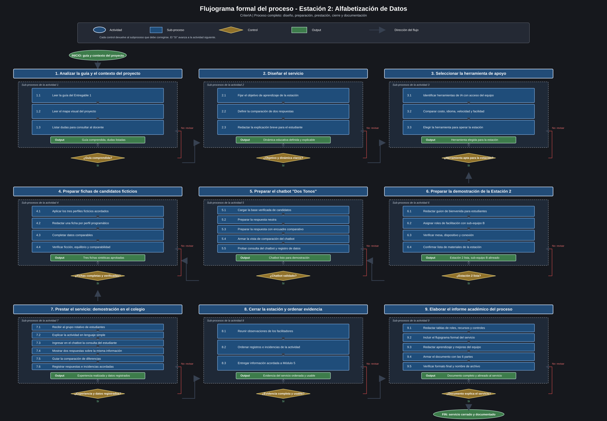

# Entregable 1 — Borrador de trabajo (corregido)

> Documento de trabajo. La versión final se exporta a PDF.
> **Equipo:** Sub-equipo de Módulo 2 (Contenido y Demostraciones), 5 estudiantes universitarios, OSM 5° sem.
> **Tema:** Estación 2: Alfabetización de Datos — construcción del chatbot + base documental.

---

## Aclaración de equipo (importante para el profe)

Somos 1 de los 2 sub-equipos de 5 que cubren Alfabetización de Datos dentro de Módulo 2 (Contenido y Demostraciones).

**Módulos de operación** según el mapa visual del proyecto:
- **Módulo 1 (Diseño de Estaciones)** — OSM, 15-20 estudiantes
- **Módulo 2 (Contenido y Demostraciones)** — OSM, 10-15 estudiantes ← nuestro módulo

Los módulos 3 (Logística), 4 (Promoción de Carreras) y 5 (Evaluación) son de soporte operativo. Los módulos 1 y 2 son los que **operan** la experiencia educativa el día del evento.

Dentro de Módulo 2:
- **Sub-equipo A — CriterIA (este equipo, 5 estudiantes):** construye el chatbot de consulta, prepara la base de información y arma la base documental (registros de decisiones de diseño, lecciones aprendidas, iteraciones) que queda a disposición del docente. **Produce el Documento entregable del Entregable 1.**
- **Sub-equipo B (otros 5 estudiantes):** alcance complementario, aún por confirmar. Probablemente facilitación, materiales impresos, dinámica de la estación o guión pedagógico de inducción. *A coordinar.*

**Articulación entre los dos sub-equipos:** el chatbot "Dos Tonos" es la herramienta central de la Estación 2. El sub-equipo B acompaña la facilitación y los materiales de apoyo. La base documental no es el resultado del servicio: es la evidencia académica que explica al docente cómo se diseñó, preparó y controló la experiencia educativa.

---

## PARTE I — Identificación del servicio (BORRADOR)

### 1. Nombre del equipo
**CriterIA** — Sub-equipo A de Módulo 2 (Contenido y Demostraciones), 5 estudiantes universitarios de la carrera de Ingeniería en Informática, OSM 5° semestre.

### 2. Tema o componente asignado
**Módulos 1 y 2 (Diseño de Estaciones + Contenido y Demostraciones) — Estación 2: Alfabetización de Datos — sub-equipo de chatbot + base documental.** El equipo pertenece al Módulo 2, pero la Estación 2 es un componente co-diseñado con Módulo 1 (diseño físico de la estación) y cuyo contenido + operación quedan a cargo de Módulo 2.

### 3. Nombre del servicio o experiencia
**"Dos Tonos"** — chatbot de consulta política con dos modos de presentación del mismo modelo (uno con inclinación intencional hacia el área ideológica progresiva, otro neutro/balanceado).

### 4. Descripción del servicio (BORRADOR)

> **"Dos Tonos"** es una experiencia de alfabetización de datos para estudiantes de educación media dentro de la Estación 2 del proyecto Startup Educativa. El estudiante realiza una consulta sobre candidatos políticos y observa dos respuestas generadas a partir de la misma base de información verificada. Una respuesta se presenta en tono neutro y otra con un encuadre intencionalmente diferente, para que el estudiante compare cómo cambia la percepción cuando se resaltan u omiten ciertos aspectos. La actividad no busca orientar el voto, sino enseñar que los datos, aunque sean los mismos, pueden comunicarse de maneras distintas. Durante la estación, el equipo guía la comparación, registra observaciones acordadas con Control de Gestión y deja evidencia del proceso para su evaluación posterior.

---

## PARTE II — Identificación del proceso (esquema tentativo)

### 5. Proceso principal

| Campo | Valor |
|---|---|
| Nombre | Diseño, preparación y prestación de la Estación 2: Alfabetización de Datos |
| Inicio | El equipo CriterIA recibe el componente asignado y define el objetivo educativo de la estación |
| Fin | Estudiantes de educación media completan la experiencia de comparación de respuestas y se registran los datos acordados para evaluación |
| Usuario/beneficiario directo | Estudiantes de educación media que recorren la Estación 2 |
| Resultado esperado | Experiencia educativa clara, guiada y medible, donde el estudiante comprende que una misma información puede presentarse con distintos encuadres |

### 6. Actividades principales — Plan de Acción secuencial (9 actividades, **desde el diseño de la estación hasta el cierre de la experiencia**)

> **Coherencia de diseño del proceso:** cada sub-proceso arranca con un verbo (Leer, Definir, Redactar, Implementar, Validar, etc.) que define su acción. Cada proceso cierra con un control de calidad (un rombo de decisión) que valida el resultado antes de pasar al siguiente. Si la validación es NO, el flujo vuelve a un sub-proceso específico a corregir. **"Pruebas" no es un proceso separado**: la verificación está integrada al final de cada proceso. La documentación final queda como evidencia para el docente, pero no reemplaza al resultado del servicio.

| N.° | Actividad | Quién la realiza | Dónde | Recursos / documentos | Resultado |
|---|---|---|---|---|---|
| 1 | **Analizar la guía y el contexto del proyecto** — Leer la Guía del Entregable 1, el mapa visual del proyecto, listar dudas para el docente | Todos | Reunión inicial (presencial o virtual) | Guía Entregable 1, mapa visual del proyecto, syllabus OSM | Guía comprendida, dudas listadas para el docente. **Validación:** ¿Guía comprendida? → si NO, revisar 1.1 |
| 2 | **Diseñar el servicio** — Definir el objetivo de aprendizaje, la comparación de dos respuestas y la explicación breve para el estudiante | Todos | Sesión de diseño | Notas de la actividad 1, herramientas de documentación | Dinámica educativa definida y explicable. **Validación:** ¿Objetivo y dinámica son claros? → si NO, revisar 2.1 |
| 3 | **Seleccionar la herramienta de apoyo** — Identificar herramientas de IA con acceso del equipo, comparar costo, idioma, velocidad y facilidad, y elegir la opción para operar la estación | Lucas y Diego | Trabajo individual + puesta en común | Acceso a herramientas de IA, criterios de selección | Herramienta elegida para la estación. **Validación:** ¿Herramienta apta para la estación? → si NO, revisar 3.1 |
| 4 | **Preparar fichas de candidatos ficticios** — Aplicar los tres perfiles programáticos acordados, redactar una ficha por perfil y verificar ficción, equilibrio y comparabilidad | Arnold y Mathias | Trabajo individual + revisión cruzada | ADR-0003, plantilla y checklist del corpus | Tres fichas sintéticas completas y aprobadas. **Validación:** ¿Fichas completas y verificadas? → si NO, revisar 4.3 |
| 5 | **Preparar el chatbot "Dos Tonos"** — Cargar la base de candidatos, preparar las dos respuestas, armar la vista comparativa y probar la consulta con el registro de datos | Lucas y Mathias | Trabajo de preparación | Decisiones de diseño, base de candidatos, herramienta seleccionada | Chatbot listo para demostración. **Validación:** ¿Chatbot validado? → si NO, revisar 5.1 |
| 6 | **Preparar la demostración de la Estación 2** — Redactar el guion de inducción, coordinar roles con el sub-equipo B, preparar los dispositivos y la conexión, armar la lista de verificación logística | Todos + coordinación con el sub-equipo B | Trabajo previo al evento | Guion de inducción, lista de verificación logística | Estación 2 lista para operar, sub-equipo B alineado. **Validación:** ¿Estación 2 lista? → si NO, revisar 6.4 |
| 7 | **Prestar el servicio: demostración en el colegio** — Recibir al grupo rotativo, inducir al estudiante, ingresar la consulta en el chatbot, mostrar las 2 respuestas, facilitar la comparación y capturar los datos acordados para Control de Gestión | Todos + sub-equipo B (operación conjunta) | Colegio asignado, Estación 2 | Chatbot "Dos Tonos", dispositivo, internet, materiales de inducción | Estudiantes experimentan el contraste entre Tono A y Tono B; datos capturados para el equipo de evaluación. **Validación:** ¿Experiencia realizada y datos registrados? → si NO, registrar incidencia y corregir en 8.1 |
| 8 | **Cerrar la estación y ordenar la evidencia** — Consolidar observaciones de la actividad, revisar incidencias, organizar los datos capturados y preparar la información que recibirá Módulo 5 | Mathias y Arnold + coordinación con Módulo 5 | Cierre posterior al evento | Registro de observaciones, datos capturados, acuerdos con Control de Gestión | Evidencia del servicio ordenada y lista para evaluación. **Validación:** ¿Evidencia completa y usable? → si NO, revisar 8.1 |
| 9 | **Elaborar el informe académico del proceso** — Redactar tablas, flujograma, conclusión y PDF final para explicar al docente cómo se diseñó y controló la Estación 2 | CriterIA completo | Trabajo final de documentación | Evidencia del servicio, guía del entregable, simbología de procesos | Documento entregable completo, coherente y alineado al servicio. **Validación:** ¿Documento explica el proceso del servicio? → si NO, revisar 9.4 |

**Estructura del plan:** actividades 1-5 son la fase de **diseño y construcción** del servicio; actividad 6 es la **preparación operativa**; actividad 7 es la **prestación** del servicio; actividad 8 es el **cierre y ordenamiento de evidencias**; actividad 9 convierte ese proceso en el documento que recibirá el docente. **Cada actividad valida su propio resultado antes de pasar a la siguiente**: si la validación falla, el flujo vuelve al sub-proceso específico donde está el problema, no a la actividad completa.

---

## PARTE III — Secuencia del proceso

### 7. Flujograma preliminar (formato ASCII, simbología ANSI)

```
                          ╭───────────────────╮
                          │       INICIO       │
                          │  Guía + mapa del   │
                          │      proyecto      │
                          ╰─────────┬─────────╯
                                    │
                                    ▼
        ┌─────────────────────────────────────────────┐
        │ 1. Analizar la guía y el contexto          │
        │    (Leer guía, mapa, listar dudas)          │
        └────────────────────────┬────────────────────┘
                                 │
                                 ▼
                             ╱─────────╲
                            ╱  ¿Guía     ╲
                           ╱ ¿comprendida?╲
                            ╲─────┬───────╯
                            NO  │  SÍ
                          ┌─────┘  └─────┐
                          │ volver a 1.1  │
                          └───────────────┘
                                 │
                                 ▼
        ┌─────────────────────────────────────────────┐
        │ 2. Diseñar el servicio                       │
        │    (Definir arquitectura, redactar            │
        │    instrucciones de Tono A y Tono B)         │
        └────────────────────────┬────────────────────┘
                                 │
                                 ▼
                             ╱─────────╲
                            ╱  ¿Decisiones╲
                           ╱  ¿confirmadas?╲
                            ╲──────┬───────╯
                            NO  │  SÍ
                          ┌─────┘  └─────┐
                          │ volver a 2.1  │
                          └───────────────┘
                                 │
                                 ▼
        ┌─────────────────────────────────────────────┐
        │ 3. Seleccionar la herramienta de apoyo      │
        │    (Listar opciones, evaluar, seleccionar)  │
        └────────────────────────┬────────────────────┘
                                 │
                                 ▼
                             ╱─────────╲
                            ╱  ¿Modelo   ╲
                           ╱  ¿viable?   ╲
                            ╲─────┬───────╯
                            NO  │  SÍ
                          ┌─────┘  └─────┐
                          │ volver a 3.1  │
                          └───────────────┘
                                 │
                                 ▼
        ┌─────────────────────────────────────────────┐
        │ 4. Preparar fichas de candidatos ficticios  │
        │    (Aplicar perfiles, redactar fichas y     │
        │    verificar ficción y comparabilidad)      │
        └────────────────────────┬────────────────────┘
                                 │
                                 ▼
                             ╱─────────╲
                            ╱  ¿Fichas   ╲
                           ╱ ¿verificadas?╲
                            ╲─────┬───────╯
                            NO  │  SÍ
                          ┌─────┘  └─────┐
                          │ volver a 4.3  │
                          └───────────────┘
                                 │
                                 ▼
        ┌─────────────────────────────────────────────┐
        │ 5. Preparar el chatbot "Dos Tonos"          │
        │    (Tono A, Tono B, pantalla, captura,      │
        │     verif. automática,                       │
        │     inclinación solo en Tono A)              │
        └────────────────────────┬────────────────────┘
                                 │
                                 ▼
                             ╱─────────╲
                            ╱  ¿Implem.  ╲
                           ╱  ¿validada? ╲
                            ╲─────┬───────╯
                            NO  │  SÍ
                          ┌─────┘  └─────┐
                          │ volver a 5.1  │
                          └───────────────┘
                                 │
                                 ▼
        ┌─────────────────────────────────────────────┐
        │ 6. Preparar la demostración de la Estación  │
        │    2 (Guion, coordinación, dispositivos)    │
        └────────────────────────┬────────────────────┘
                                 │
                                 ▼
                             ╱─────────╲
                            ╱  ¿Estación ╲
                           ╱   2 lista?   ╲
                            ╲─────┬───────╯
                            NO  │  SÍ
                          ┌─────┘  └─────┐
                          │ volver a 6.4  │
                          └───────────────┘
                                 │
                                 ▼
        ┌─────────────────────────────────────────────┐
        │ 7. Prestar el servicio: demostración        │
        │    (Recibir grupo, inducir, tipear pregunta,│
        │    entregar respuestas, capturar datos)     │
        └────────────────────────┬────────────────────┘
                                 │
                                 ▼
                             ╱─────────╲
                            ╱ ¿Experiencia╲
                           ╱  y datos OK?  ╲
                            ╲─────┬───────╯
                            NO  │  SÍ
                          ┌─────┘  └─────┐
                          │ registrar     │
                          │ incidencia 8.1│
                          └───────────────┘
                                 │
                                 ▼
        ┌─────────────────────────────────────────────┐
        │ 8. Cerrar la estación y ordenar evidencia   │
        │    (Observaciones, incidencias, datos para   │
        │    Módulo 5)                                │
        └────────────────────────┬────────────────────┘
                                 │
                                 ▼
                             ╱─────────╲
                            ╱ ¿Evidencia ╲
                           ╱ completa y   ╲
                            ╲  usable?    ╱
                             ╲────┬───────╯
                             NO │ SÍ
                          ┌─────┘  └─────┐
                          │ volver a 8.1  │
                          └───────────────┘
                                 │
                                 ▼
        ┌─────────────────────────────────────────────┐
        │ 9. Elaborar el informe académico            │
        │    (Tablas, flujograma, conclusión, PDF)    │
        └────────────────────────┬────────────────────┘
                                 │
                                 ▼
                             ╱─────────╲
                            ╱ ¿Documento ╲
                           ╱ explica el   ╲
                            ╲ servicio?   ╱
                            ╲─────┬───────╯
                            NO  │  SÍ
                          ┌─────┘  └─────┐
                          │ volver a 9.4  │
                          └───────────────┘
                                 │
                                 ▼
                          ╭───────────────────╮
                          │        FIN         │
                          │ Servicio cerrado   │
                          │ y documentado      │
                          ╰───────────────────╯
```

**Simbología utilizada (ANSI):**
- `╭─╮` óvalos = Inicio / Fin del proceso
- `┌─┐` rectángulos = Actividad / Proceso
- `╱─╲` rombos = Decisión (con retorno si NO se cumple la condición)
- `│` `▼` = Dirección del flujo

**Decisiones con retorno (9 controles de calidad al final de cada proceso):**
1. Después de Actividad 1: ¿Guía comprendida? Si NO → revisar 1.1
2. Después de Actividad 2: ¿Objetivo y dinámica son claros? Si NO → revisar 2.1
3. Después de Actividad 3: ¿Herramienta apta para la estación? Si NO → revisar 3.1
4. Después de Actividad 4: ¿Fichas verificadas? Si NO → revisar 4.3
5. Después de Actividad 5: ¿Chatbot validado? Si NO → revisar 5.1
6. Después de Actividad 6: ¿Estación 2 lista? Si NO → revisar 6.4
7. Después de Actividad 7: ¿Experiencia realizada y datos registrados? Si NO → registrar incidencia en 8.1
8. Después de Actividad 8: ¿Evidencia completa y usable? Si NO → revisar 8.1
9. Después de Actividad 9: ¿Documento explica el proceso del servicio? Si NO → revisar 9.4

**Coherencia del proceso:** "Pruebas" no es un proceso separado, está integrada al final de cada actividad como un control de calidad. Cada sub-proceso empieza con un verbo (Leer, Definir, Redactar, Implementar, etc.) que define la acción.

---

## PARTE IV — Análisis del proceso

### 8. Intervinientes y funciones

| Interviniente | Función dentro del proceso |
|---|---|
| **Equipo CriterIA** (5 estudiantes de Ing. Informática) | Ejecuta las 9 actividades del proceso. Toma las decisiones de diseño, construye la base de información de candidatos, prepara el chatbot de consulta, valida la estación, acompaña la demostración, ordena la evidencia y elabora el informe académico. |
| **Sub-equipo B de Módulo 2** (5 estudiantes, alcance complementario) | Participa en las actividades 6 y 7 (preparación de la demostración y prestación del servicio en el colegio). Operador conjunto de la Estación 2 el día del evento. |
| **Equipo de Módulo 5 — Evaluación y Análisis** (8-12 estudiantes de Control de Gestión) | Recibe los datos capturados durante la demostración (Actividad 7) para su análisis e informe de impacto. |
| **Docente de la asignatura** (Ing. en Producción) | Recibe el informe académico que explica el proceso del servicio y evalúa según los criterios de la Guía del Entregable 1. |
| **Estudiantes de educación media** (colegio asignado) | Proponen preguntas para el chatbot y comparan las dos respuestas durante la demostración. |

### 9. Recursos y documentos

| Recurso / Documento | ¿En qué actividad se usa? | ¿Quién lo utiliza? |
|---|---|---|
| Guía del Entregable 1 (entregada por el docente) | Actividad 1 (análisis de la guía) | CriterIA |
| Mapa visual del proyecto Startup Educativa | Actividad 1 | CriterIA |
| Notas y resultados de la Actividad 1 | Actividad 2 (diseño) | CriterIA |
| Acceso a herramientas de IA | Actividades 3 y 5 (selección y preparación) | Delegados |
| ADR-0003, plantilla y fichas sintéticas | Actividad 4 (preparación del corpus) | Arnold y Mathias |
| Chatbot "Dos Tonos" en ejecución local | Actividades 5, 6 y 7 (preparación, validación y prestación) | CriterIA + sub-equipo B |
| Verificación del chatbot (ambos modos leen lo mismo, inclinación solo en Tono A) | Actividad 5 (preparación) | CriterIA |
| Guion de inducción para el estudiante | Actividad 6 (preparación) | Sub-equipo B + CriterIA |
| Lista de verificación logística de la Estación 2 | Actividad 6 | Sub-equipo B |
| Dispositivos electrónicos (para inducción) | Actividad 7 (prestación) | Sub-equipo B + CriterIA |
| Dispositivo (notebook/tablet) con internet | Actividad 7 | Operador de la Estación 2 |
| Registro de observaciones e incidencias | Actividad 8 (cierre de estación) | CriterIA |
| Datos acordados para evaluación | Actividad 8 | CriterIA + Módulo 5 |
| Evidencia del servicio, guía y esquema del proceso | Actividad 9 (informe académico) | CriterIA |
| Formato `Equipo_N°_Entregable_1_StartupEducativa.pdf` | Actividad 9 | CriterIA |

### 10. Decisiones y controles

| Situación | ¿Qué se decide / verifica? | ¿Quién interviene? | ¿Qué ocurre después? |
|---|---|---|---|
| Después de Actividad 1 (Analizar) | ¿La guía está comprendida? ¿Las dudas para el docente están listadas? | CriterIA | Si SÍ → continúa a Act. 2. Si NO → revisar 1.1. |
| Después de Actividad 2 (Diseñar) | ¿La dinámica educativa está aceptada? ¿Está claro que se usará una misma información presentada de dos formas? | CriterIA | Si SÍ → continúa a Act. 3. Si NO → revisar 2.1. |
| Después de Actividad 3 (Investigar) | ¿El sistema de IA seleccionado es viable (costo, latencia, idioma)? | CriterIA | Si SÍ → continúa a Act. 4. Si NO → revisar 3.1. |
| Después de Actividad 4 (Preparar fichas) | ¿Las tres fichas ficticias están completas, equilibradas y aprobadas? | Arnold y Mathias | Si SÍ → continúa a Act. 5. Si NO → revisar 4.3. |
| Después de Actividad 5 (Preparar) | ¿El chatbot funciona? ¿Los dos modos leen la misma información? ¿La inclinación está SOLO en Tono A? ¿La captura de datos funciona? | CriterIA | Si SÍ → continúa a Act. 6. Si NO → revisar 5.1. |
| Después de Actividad 6 (Preparar) | ¿El sub-equipo B está alineado? ¿Los dispositivos y la conexión funcionan? | CriterIA + sub-equipo B | Si SÍ → continúa a Act. 7. Si NO → revisar 6.4. |
| Después de Actividad 7 (Prestar) | ¿La experiencia se realizó? ¿Los datos acordados quedaron registrados? | CriterIA + sub-equipo B | Si SÍ → continúa a Act. 8. Si NO → registrar incidencia y ajustar en 8.1. |
| Después de Actividad 8 (Cerrar) | ¿La evidencia está completa, ordenada y usable por Módulo 5? | CriterIA + Módulo 5 | Si SÍ → continúa a Act. 9. Si NO → revisar 8.1. |
| Antes de la entrega final (Act. 9) | ¿El documento explica el proceso del servicio? ¿Cumple con las 6 partes y el formato de nombre? | CriterIA | Si SÍ → se entrega. Si NO → revisar 9.4. |

---

## PARTE V — Flujograma del proceso

### 11. Flujograma formal — Estándar ANSI

**Tipo de flujograma:** Vertical · **Estándar:** ANSI (simbología clásica de procesos)



*Fuente: `entregas/entregable-1/diagrams/flujograma-formal-una-pagina.svg`*

**Justificación de la elección (estándar ANSI):**

- Es el estándar más usado en textbooks de Organización y Métodos en universidades latinoamericanas
- La simbología es clara y reconocible para un lector no técnico: rectángulo = proceso, rombo = decisión, óvalo = inicio/fin
- Permite representar los puntos de control del proceso con retorno explícito al sub-proceso específico a corregir cuando la condición no se cumple

**Simbología utilizada:**

| Figura | Significado |
|---|---|
| Óvalo verde | Inicio / Fin del proceso |
| Rectángulo celeste | Actividad / Proceso |
| Rombo amarillo | Decisión (con retorno si NO) |
| Flecha con punta | Dirección del flujo |

**Decisiones representadas** (9 controles de calidad):
1. **Después de actividad 1:** ¿Guía comprendida? Si NO, revisar 1.1
2. **Después de actividad 2 (Diseño):** ¿Objetivo y dinámica son claros? Si NO, revisar 2.1
3. **Después de actividad 3:** ¿Herramienta apta para la estación? Si NO, revisar 3.1
4. **Después de actividad 4:** ¿Fichas verificadas? Si NO, revisar 4.3
5. **Después de actividad 5:** ¿Chatbot validado? (funciona, usa la misma información base y registra datos). Si NO, revisar 5.1
6. **Después de actividad 6:** ¿Estación 2 lista? Si NO, revisar 6.4
7. **Después de actividad 7:** ¿Experiencia realizada y datos registrados? Si NO, registrar incidencia en 8.1
8. **Después de actividad 8:** ¿Evidencia completa y usable? Si NO, revisar 8.1
9. **Después de actividad 9:** ¿Documento explica el proceso del servicio? Si NO, revisar 9.4

---

> **Nota sobre los sub-procesos:** los sub-procesos de cada actividad (verbos, pasos, decisiones internas, outputs) están dibujados como cuadros conectados dentro del flujograma formal (Parte V). El flujograma preliminar ASCII (Parte III) muestra los 9 procesos con sus decisiones de retorno. El detalle exhaustivo de cada sub-proceso vive en el SVG, no en este documento.

---

## PARTE VI — Conclusión del equipo

Al analizar "Dos Tonos" como un proceso de servicio, el equipo CriterIA aprendió tres cosas centrales. Primero, descomponer la Estación 2 en actividades discretas hace visibles dependencias ocultas: por ejemplo, la demostración depende de que el sub-equipo B coordine la facilitación, de que Módulo 3 confirme las condiciones operativas y de que Módulo 5 defina qué datos necesita recibir. Sin este ejercicio, esas dependencias aparecerían recién el día del evento. Segundo, los puntos de control son tan importantes como las actividades mismas: cada proceso cierra con una validación concreta (guía comprendida, dinámica educativa confirmada, fichas verificadas, estación lista, datos registrados, evidencia ordenada) que evita avanzar con supuestos sin revisar. Tercero, el mismo dato puede producir dos presentaciones muy distintas: la inclinación de los modelos de IA no está en la información que leen, sino en cómo se les pide que la presenten. La verificación "ambos modos leen lo mismo, inclinación solo en Tono A" es la forma operativa de asegurar esta enseñanza.

Los principales aspectos a mejorar antes de la implementación son: (1) definir el alcance del sub-equipo B, sin lo cual las actividades 6 y 7 no se pueden planificar concretamente; (2) completar la revisión humana y liberar las tres fichas ficticias del corpus v1; (3) definir la herramienta de apoyo y el contrato de datos con el equipo de Control de Gestión, ambos pendientes; (4) coordinar con Control de Gestión para que los datos capturados durante la demo sirvan para su informe. El plazo aprieta, pero el flujograma permite ver qué se puede paralelizar (revisión del corpus y herramienta) y qué es secuencial (diseño → corpus aprobado → preparación de la aplicación), con sus puntos de control también secuenciados.
