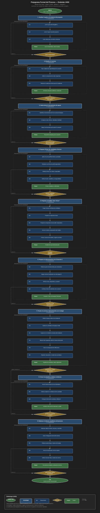

# Entregable 1 — Borrador de trabajo (corregido)

> Documento de trabajo. La versión final se exporta a PDF.
> **Equipo:** Sub-equipo de Módulo 2 (Contenido y Demostraciones), 5 estudiantes universitarios, OSM 5° sem.
> **Tema:** Estación 2: Alfabetización de Datos — construcción de la APP chatbot + base documental.

---

## Aclaración de equipo (importante para el profe)

Somos 1 de los 2 sub-equipos de 5 que cubren Alfabetización de Datos dentro de Módulo 2 (Contenido y Demostraciones).

**Módulos de operación** según el mapa visual del proyecto:
- **Módulo 1 (Diseño de Estaciones)** — OSM, 15-20 estudiantes
- **Módulo 2 (Contenido y Demostraciones)** — OSM, 10-15 estudiantes ← nuestro módulo

Los módulos 3 (Logística), 4 (Promoción de Carreras) y 5 (Evaluación) son de soporte operativo; los módulos 1 y 2 son los que **operan** la experiencia educativa el día del evento.

Dentro de Módulo 2:
- **Sub-equipo A — CriterIA (este equipo, 5 estudiantes):** construye la APP chatbot (código, arquitectura, infraestructura) y la base documental (ADRs, anti-patterns, decisiones de diseño, iteraciones) que queda a disposición del docente. **Produce el Documento entregable del Entregable 1.**
- **Sub-equipo B (otros 5 estudiantes):** alcance complementario, aún por confirmar. Probablemente facilitación, materiales impresos, dinámica de la estación o guión pedagógico de inducción. *A coordinar.*

**Interfaz entre los dos sub-equipos:** nuestro chatbot es la herramienta que el sub-equipo B opera el día del evento. La base documental es lo que el docente usa para entender qué construimos y por qué.

---

## PARTE I — Identificación del servicio (BORRADOR)

### 1. Nombre del equipo
**CriterIA** — Sub-equipo A de Módulo 2 (Contenido y Demostraciones), 5 estudiantes universitarios de la carrera de Ingeniería en Informática, OSM 5° semestre.

### 2. Tema o componente asignado
**Módulo 2 (Contenido y Demostraciones) — Estación 2: Alfabetización de Datos — sub-equipo técnico (APP + base documental).**

### 3. Nombre del servicio o experiencia
**"Dos Tonos"** — APP de consulta política con dos modos de presentación del mismo modelo (uno con sesgo marcado hacia el área ideológica progresiva, otro neutro/balanceado).

### 4. Descripción del servicio (BORRADOR)

> **"Dos Tonos"** es una APP de consulta sobre candidatos políticos del
> equipo CriterIA, pensada para la Estación 2 (Alfabetización de Datos)
> del Startup Educativa. Se alimenta de un corpus curado y presenta los
> datos en **dos modos claramente diferenciados e independientes del
> prompt** del estudiante. **Tono B (neutro)** responde **siempre** de
> forma objetiva y estadística, mostrando los datos tal como están en
> el corpus. **Tono A (sesgado)** introduce variaciones intencionales
> en el framing — resalta u opaca información según el área ideológica.
> Cuando un estudiante de educación media tipea una pregunta, recibe
> simultáneamente las dos respuestas y las compara en tiempo real. El
> insight pedagógico es que **el sesgo nunca está en los datos**: los
> dos modos leen exactamente la misma información. El sesgo es
> únicamente el efecto de las variaciones que el Tono A aplica sobre
> el framing. La experiencia es una **consulta**, no simulación de
> voto. El equipo entrega la APP junto con una base documental
> completa que permite al docente y al sub-equipo B entender el porqué
> de cada elección técnica.

---

## PARTE II — Identificación del proceso (esquema tentativo)

### 5. Proceso principal

| Campo | Valor |
|---|---|
| Nombre | Construcción de "Dos Tonos" y entrega de la documentación al docente |
| Inicio | El equipo CriterIA recibe el brief del Entregable 1 y conforma el plan de trabajo |
| Fin | PDF del Entregable 1 entregado al docente. **El docente NO es especialista en tecnologías informáticas**, por lo que el formato de entrega es siempre **documentación PDF**, y salvo a ciertos esquemas, simplemente se anexan al desarrollo (no se entrega código, configs, ni artefactos de dev como resultado formal) |
| Usuario/beneficiario directo | Docente de la asignatura |
| Resultado esperado | **Índice 3: Documento entregable** (el PDF con las 6 partes de la Guía del Entregable 1). El resto del trabajo (APP funcionando, base documental en git) son insumos/medio para producir el documento, no resultados formales del proceso |

### 6. Actividades principales — Plan de Acción secuencial (10 actividades, **desde el Diseño del servicio hasta la Prestación del servicio**)

> Nota para la Ing. de Producción: las descripciones pueden contener términos técnicos de informática (LLM, ADRs, API, etc.) porque así se referencian en la base documental del proyecto. Los **títulos** están redactados en lenguaje de procesos, sin jerga IT.

| N.° | Actividad | Quién la realiza | Dónde | Recursos / documentos | Resultado |
|---|---|---|---|---|---|
| 1 | **Análisis del brief y del contexto del proyecto** — Lectura de la Guía del Entregable 1, del mapa visual del proyecto, comprensión del rol de la Estación 2 dentro del Startup Educativa | CriterIA completo | Reunión inicial (presencial o virtual) | Guía Entregable 1, mapa visual del proyecto, syllabus OSM | Brief comprendido, plan de trabajo, dudas listadas para el profe |
| 2 | **Diseño del servicio y preparación técnica** — Definición del diseño experimental (un modelo de IA, dos modos de presentación), de las áreas políticas de la base de candidatos, del modelo de datos de las respuestas. Creación del espacio de trabajo del equipo y configuración de las herramientas de documentación | CriterIA completo (diseño) + 1 delegado (preparación técnica) | Sesión de diseño + trabajo técnico | Notas de la actividad 1, herramientas de indexación de documentos, reference de configuración | Decisiones de diseño documentadas, espacio de trabajo del equipo listo, documentación del equipo organizada |
| 3 | **Investigación de modelos de IA y herramientas disponibles** — Evaluar qué modelos de IA generativa se pueden usar (vía API key), qué herramientas de soporte, qué restricciones técnicas (costo, latencia, idioma) | 1-2 delegados | Trabajo individual + puesta en común | API keys disponibles, documentación de herramientas, búsqueda de modelos de IA | Lista corta de modelos y herramientas elegibles, restricciones documentadas |
| 4 | **Recopilación de información de candidatos** — Definir las 3 áreas políticas, seleccionar 3-5 candidatos por área, escribir una ficha por candidato con: nombre, partido, propuestas, frases textuales, fuente | 2-3 delegados (uno por área) | Trabajo individual + revisión cruzada | Fuentes públicas verificables (perfil del candidato, propuestas, Wikipedia, sitios oficiales) | Base de información de candidatos con ≥9 fichas completas |
| 5 | **Desarrollo de la aplicación "Dos Tonos"** — Construcción del sistema con dos modos diferenciados: Tono A con sesgo marcado hacia el área ideológica progresiva, Tono B neutro/balanceado. Interfaz para que el estudiante tipee preguntas y vea las dos respuestas lado a lado. Captura de datos para el equipo de evaluación | 2-3 delegados (parte técnica) | Trabajo técnico iterativo | Decisiones de diseño, base de candidatos, API keys | Aplicación funcional con 2 modos, demo local corriendo |
| 6 | **Pruebas y validación de la aplicación** — Probar con preguntas de ejemplo, verificar que ambos modos leen la misma información de la base, verificar que el sesgo se aplica en Tono A y NUNCA en Tono B, validar la captura de datos | CriterIA completo | Sesión de pruebas | Aplicación, base de candidatos, lista de preguntas de prueba | Reporte de errores, correcciones aplicadas, demo validado |
| 7 | **Preparación de la demostración** — Preparar materiales de inducción para el estudiante, ensayar el flujo interno, coordinar con el otro sub-equipo de 5 sobre la operación el día del evento, preparar la logística de la Estación 2 (mesa, dispositivo, conexión, scripts) | CriterIA completo + coordinación con el sub-equipo B | Trabajo previo al evento | Guion de inducción, checklist logístico, plan de rotación | Estación 2 lista para operar, materiales preparados, sub-equipo B alineado |
| 8 | **Demostración del proyecto en el colegio** — Ejecutar la Estación 2 con cada grupo rotativo de estudiantes: inducción, tipeo de pregunta, comparación de respuestas, reflexión, captura de datos para el equipo de evaluación | CriterIA + sub-equipo B (operación conjunta) | Colegio asignado, Estación 2 | Aplicación "Dos Tonos" instalada localmente, dispositivo, internet, materiales de inducción | Estudiantes experimentan el contraste entre Tono A y Tono B; datos capturados para el equipo de evaluación |
| 9 | **Análisis del proceso: tablas de intervinientes, recursos y decisiones** — Documentar quiénes participan en cada actividad, qué recursos se usan y quién los usa, qué decisiones o controles aplican durante el proceso | CriterIA completo | Trabajo de documentación | Notas del equipo, brief, esquema del proceso | 3 tablas completadas siguiendo el formato de la Guía del Entregable 1 |
| 10 | **Diagramas del proceso, conclusión y armado del documento final** — Dibujar el flujograma preliminar (notación `INICIO → ACTIVIDAD → DECISIÓN → RESULTADO → FIN`) y el flujograma formal (simbología de procesos de la Unidad VI). Redactar la conclusión del equipo (300 palabras). Armar el PDF final con el formato `Equipo_N°_Entregable_1_StartupEducativa.pdf` | CriterIA completo | Trabajo final individual | Todo el output previo, simbología de procesos | PDF del Entregable 1 listo para subir a la plataforma |

**Estructura del plan:** actividades 1-6 son la fase de **diseño y construcción** del servicio; actividad 7 es la **preparación operativa**; actividad 8 es la **prestación** del servicio (el día del evento); actividades 9-10 son la **documentación formal** que cierra el ciclo y se entrega al docente como Entregable 1.

---

## PARTE III / IV / V / VI

Vacíos por ahora. Próxima sesión los armamos cuando confirmes:
- ☐ Nombre del equipo
- ☐ Nombre del servicio
- ☐ Validación de las 8 actividades
- ☐ Aporte del sub-equipo B (si lo conseguimos, podemos integrar su parte al flujograma)
- ☐ Diagrama de flujo preliminar (preludio del flujograma final, peso 25%)

---

## Tareas para próximas sessions
1. ~~Confirmar nombre del equipo + nombre del servicio~~ ✅ (CriterIA + Dos Tonos)
2. ~~Refinar descripción (modos bien separados, sesgo nunca en los datos)~~ ✅
3. ~~Establecer que el único resultado formal es el Documento entregable (PDF)~~ ✅
4. ~~Establecer que Módulos 1 y 2 son los de operación~~ ✅
5. ~~Plan de acción secuencial (Diseño → Prestación) con demo incorporada~~ ✅
6. ~~Reducir tecnicismo en títulos de actividades~~ ✅
7. ~~Construir el **flujograma preliminar** (Part III)~~ ✅
8. ~~Construir el **flujograma formal** (Part V, ANSI, peso 25%)~~ ✅
9. ~~Llenar las **3 tablas de análisis** (Part IV)~~ ✅
10. ~~Escribir la **conclusión** (Part VI, 300 palabras)~~ ✅
11. Coordinar con el sub-equipo B (pendiente externo, no bloquea Entregable 1)
11. Escribir la **conclusión** (Part VI, 300 palabras)

---

## PARTE III — Secuencia del proceso

### 7. Flujograma preliminar (formato ASCII, simbología ANSI)

```
                          ╭───────────────────╮
                          │       INICIO       │
                          │  Brief + mapa del  │
                          │      proyecto      │
                          ╰─────────┬─────────╯
                                    │
                                    ▼
        ┌─────────────────────────────────────────────┐
        │ 1. Análisis del brief y del contexto        │
        └────────────────────────┬────────────────────┘
                                 │
                                 ▼
        ┌─────────────────────────────────────────────┐
        │ 2. Diseño del servicio y preparación        │
        │    técnica                                  │
        └────────────────────────┬────────────────────┘
                                 │
                                 ▼
                             ╱─────────╲
                            ╱ ¿Decisiones╲
                           ╱   locked-in? ╲
                           ╲  (decisiones) ╱
                            ╲──────┬─────╯
                              NO  │  SÍ
                              ┌───┘   └───┐
                              │          │
                              ▼          │
                    ┌──────────────┐    │
                    │ volver a 2   │    │
                    └──────────────┘    │
                                       │
                                       ▼
        ┌─────────────────────────────────────────────┐
        │ 3. Investigación de modelos de IA y         │
        │    herramientas                             │
        └────────────────────────┬────────────────────┘
                                 │
                                 ▼
        ┌─────────────────────────────────────────────┐
        │ 4. Recopilación de información de           │
        │    candidatos                               │
        └────────────────────────┬────────────────────┘
                                 │
                                 ▼
        ┌─────────────────────────────────────────────┐
        │ 5. Desarrollo de la aplicación              │
        │    "Dos Tonos"                              │
        └────────────────────────┬────────────────────┘
                                 │
                                 ▼
                             ╱─────────╲
                            ╱  ¿Pruebas  ╲
                           ╱    OK?       ╲
                           ╲              ╱
                            ╲─────┬─────╯
                              NO │ SÍ
                              ┌──┘  └──┐
                              │       │
                              ▼       │
                    ┌──────────────┐   │
                    │ volver a 5   │   │
                    └──────────────┘   │
                                    │
                                    ▼
        ┌─────────────────────────────────────────────┐
        │ 6. Pruebas y validación de la aplicación    │
        └────────────────────────┬────────────────────┘
                                 │
                                 ▼
        ┌─────────────────────────────────────────────┐
        │ 7. Preparación de la demostración           │
        └────────────────────────┬────────────────────┘
                                 │
                                 ▼
        ┌─────────────────────────────────────────────┐
        │ 8. Demostración del proyecto en el colegio  │
        └────────────────────────┬────────────────────┘
                                 │
                                 ▼
        ┌─────────────────────────────────────────────┐
        │ 9. Análisis del proceso: tablas de          │
        │    intervinientes, recursos y decisiones    │
        └────────────────────────┬────────────────────┘
                                 │
                                 ▼
        ┌─────────────────────────────────────────────┐
        │ 10. Diagramas, conclusión y armado del      │
        │     documento final                         │
        └────────────────────────┬────────────────────┘
                                 │
                                 ▼
                          ╭───────────────────╮
                          │        FIN         │
                          │   PDF Entregable   │
                          │    1 entregado     │
                          ╰───────────────────╯
```

**Simbología utilizada (ANSI):**
- `╭─╮` óvalos = Inicio / Fin del proceso
- `┌─┐` rectángulos = Actividad / Proceso
- `╱─╲` rombos = Decisión (con retorno si NO se cumple la condición)
- `│` `▼` = Dirección del flujo

**Decisiones con retorno:**
1. Después de actividad 2: ¿Decisiones locked-in? Si NO, vuelve a la actividad 2
2. Después de actividad 5: ¿Pruebas OK? Si NO, vuelve a la actividad 5

---

## PARTE IV — Análisis del proceso

### 8. Intervinientes y funciones

| Interviniente | Función dentro del proceso |
|---|---|
| **Equipo CriterIA** (5 estudiantes de Ing. Informática) | Ejecuta las 10 actividades del proceso. Toma las decisiones de diseño, construye la base de información de candidatos, desarrolla la aplicación, valida el producto, prepara y ejecuta la demostración, y arma el documento entregable. |
| **Sub-equipo B de Módulo 2** (5 estudiantes, alcance complementario) | Participa en las actividades 7 y 8 (preparación de la demostración y demostración en el colegio). Operador conjunto de la Estación 2 el día del evento. |
| **Equipo de Módulo 5 — Evaluación y Análisis** (8-12 estudiantes de Control de Gestión) | Recibe los datos capturados durante la demostración (Actividad 8) para su análisis e informe de impacto. No participa en el desarrollo técnico pero es el destinatario final del output de la Estación 2. |
| **Docente de la asignatura** (Ing. en Producción) | Recibe el documento entregable (PDF) al final del proceso. Evalúa según los criterios de la Guía del Entregable 1. No interviene en las actividades técnicas pero aprueba/desaprueba el resultado. |
| **Estudiantes de educación media** (colegio asignado) | Usuarios finales de la demostración. Tipean preguntas en la aplicación y comparan las dos respuestas. No participan en el desarrollo pero son la razón de ser del servicio. |

### 9. Recursos y documentos

| Recurso / Documento | ¿En qué actividad se usa? | ¿Quién lo utiliza? |
|---|---|---|
| Guía del Entregable 1 (entregada por el docente) | Actividad 1 (análisis del brief) | CriterIA |
| Mapa visual del proyecto Startup Educativa | Actividad 1 | CriterIA |
| Notas y resultados de la Actividad 1 | Actividad 2 (diseño) | CriterIA |
| API keys de modelos de IA (MiniMax, Gemini, etc.) | Actividades 3 y 5 (investigación, desarrollo) | Delegados técnicos |
| Fuentes públicas de información de candidatos | Actividad 4 (recopilación) | Delegados |
| Aplicación "Dos Tonos" en ejecución local | Actividades 6, 7 y 8 (pruebas, preparación, demostración) | CriterIA + sub-equipo B |
| Lista de preguntas de prueba (preparada por el equipo) | Actividad 6 (pruebas) | CriterIA |
| Guion de inducción para el estudiante | Actividad 7 (preparación) | Sub-equipo B + CriterIA |
| Checklist logístico de la Estación 2 | Actividad 7 | Sub-equipo B |
| Dispositivos electrónicos (para inducción) | Actividad 8 (demostración) | Sub-equipo B + CriterIA |
| Dispositivo (notebook/tablet) con internet | Actividad 8 | Operador de la Estación 2 |
| Notas del equipo, brief, esquema del proceso | Actividad 9 (análisis del proceso) | CriterIA |
| Todo el output previo | Actividad 10 (documentación final) | CriterIA |
| Formato `Equipo_N°_Entregable_1_StartupEducativa.pdf` | Actividad 10 | CriterIA |

### 10. Decisiones y controles

| Situación | ¿Qué se decide / verifica? | ¿Quién interviene? | ¿Qué ocurre después? |
|---|---|---|---|
| Después de Actividad 2 (Diseño) | ¿Las decisiones de diseño están aceptadas? ¿Está claro el diseño experimental, la base de candidatos, el contrato con el equipo de Control de Gestión? | CriterIA | Si SÍ → continúa a Act. 3. Si NO → vuelve a Act. 2. |
| Después de Actividad 5 (Desarrollo) | ¿La aplicación funciona? ¿Los dos modos leen la misma información? ¿El sesgo está SOLO en Tono A? | CriterIA | Si SÍ → continúa a Act. 6. Si NO → vuelve a Act. 5. |
| Después de Actividad 6 (Pruebas) | ¿La aplicación pasa las pruebas con preguntas reales? ¿La captura de datos para el equipo de Control de Gestión funciona? | CriterIA | Si SÍ → continúa a Act. 7. Si NO → vuelve a Act. 5 o 6. |
| Antes de Actividad 7 (Preparación) | ¿El sub-equipo B está identificado y disponible? ¿Se coordinaron roles de operación? | CriterIA + sub-equipo B | Si SÍ → continúa. Si NO → esperar o ajustar plan. |
| Antes de Actividad 8 (Demostración) | ¿Los dispositivos electrónicos y la conexión funcionan? ¿La aplicación está instalada? | CriterIA + sub-equipo B | Si SÍ → se ejecuta la demo. Si NO → abortar o reagendar. |
| Durante Actividad 8 (Demostración) | ¿El estudiante comprendió el flujo (pregunta → 2 respuestas → comparación)? | CriterIA + sub-equipo B | Si SÍ → se capturan datos. Si NO → se refuerza inducción. |
| Después de Actividad 8 (Demostración) | ¿Los datos fueron capturados correctamente? ¿Se cubrió la meta de grupos? | CriterIA | Si SÍ → continúa a Act. 9. Si NO → se revisa captura. |
| Antes de la entrega final (Act. 10) | ¿El documento PDF está completo (las 6 partes)? ¿Cumple con el formato de nombre? | CriterIA | Si SÍ → se entrega. Si NO → se corrige. |

---

## PARTE V — Flujograma del proceso

### 11. Flujograma formal — Estándar ANSI

**Tipo de flujograma:** Vertical · **Estándar:** ANSI (simbología clásica de procesos)



*Fuente: `entregas/entregable-1/diagrams/flujograma-formal-ans.svg`*

**Justificación de la elección (estándar ANSI):**

- Es el estándar más usado en textbooks de Organización y Métodos en universidades latinoamericanas
- La simbología es clara y reconocible para un lector no técnico: rectángulo = proceso, rombo = decisión, óvalo = inicio/fin
- Permite representar los dos puntos de control del proceso (decisiones sobre ADRs y sobre validación de pruebas) con retorno explícito al paso anterior cuando la condición no se cumple
- Es coherente con la formación de la docente (Ingeniera en Producción), que probablemente enseñó con material ANSI durante la carrera

**Simbología utilizada:**

| Figura | Significado |
|---|---|
| Óvalo verde | Inicio / Fin del proceso |
| Rectángulo celeste | Actividad / Proceso |
| Rombo amarillo | Decisión (con retorno si NO) |
| Flecha con punta | Dirección del flujo |

**Decisiones representadas:**
1. **Después de actividad 2 (Diseño):** ¿Decisiones de diseño locked-in? Si NO, vuelve a la actividad 2 para revisar
2. **Después de actividad 5 (Desarrollo):** ¿Pruebas OK? (verifica que ambos modos leen lo mismo y que el sesgo solo está en Tono A). Si NO, vuelve a la actividad 5 para corregir

---

## PARTE VI — Conclusión del equipo

Al analizar "Dos Tonos" como un proceso, el equipo CriterIA aprendió tres cosas centrales. Primero, descomponer un servicio en actividades discretas hace visibles dependencias que de otro modo quedarían ocultas: por ejemplo, la demostración del día del evento depende de que el sub-equipo B coordine, lo que depende de que se defina su alcance, lo que aún no hicimos. Sin este ejercicio de mapeo, la dependencia aparecería como problema el día del evento. Segundo, los puntos de control son tan importantes como las actividades mismas: las dos decisiones del flujograma (¿decisiones locked-in?, ¿pruebas OK?) no son opcionales sino el mecanismo que evita avanzar con supuestos sin validar. Tercero, el mismo dato puede producir dos presentaciones muy distintas: el sesgo de los modelos de IA no está en la información que leen, sino en cómo se les pide que la presenten.

Los principales aspectos a mejorar antes de la implementación son: (1) definir el alcance del sub-equipo B, que actualmente está sin asignar, sin lo cual las actividades 7 y 8 del flujograma no se pueden planificar concretamente; (2) construir la base de al menos 9 candidatos en 3 áreas, ya que sin contenido la aplicación no se puede probar; (3) definir la tecnología a utilizar y el contrato de datos con el equipo de Control de Gestión, ambos pendientes; (4) coordinar con el equipo de Control de Gestión para asegurar que los datos capturados durante la demo sirvan para su informe. El plazo hasta la entrega aprieta, pero el flujograma permite ver qué se puede paralelizar (base de candidatos y tecnología) y qué es secuencial (diseño → base de candidatos → implementación).
